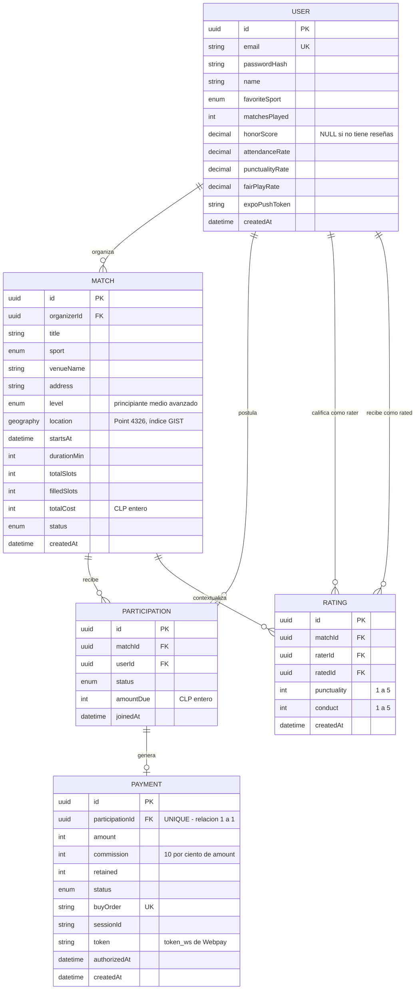

# Modelo de Datos — Kancha

> Entregable del Sprint 3 (01–14 sep 2026) · Issue **KAN-22** · Evidencia de la competencia **C3**
> Fuente de verdad del esquema: `backend/prisma/schema.prisma`. Este documento y el schema van juntos:
> si cambia uno, cambia el otro en el mismo commit.

---

## 1. Decisiones de diseño

| Decisión | Justificación |
|---|---|
| **PostgreSQL 16 + PostGIS**, no NoSQL | El dominio es fuertemente relacional (un partido tiene participaciones, cada una tiene un pago) y requiere integridad transaccional en el cobro. NoSQL obligaría a resolver a mano lo que el motor ya garantiza. |
| **`geography(Point, 4326)`** para la ubicación | Permite resolver la búsqueda por radio en la base de datos con `ST_DWithin` sobre un índice GIST. La alternativa —traer todos los partidos a memoria y calcular haversine en Node— es O(n) por consulta y no escala a más comunas. |
| **Montos en CLP como `Int`**, nunca `Float` | El punto flotante introduce errores de redondeo inaceptables en dinero. El peso chileno no tiene decimales, así que el entero es exacto por naturaleza. |
| **`honorScore` nullable** | Distingue "sin calificaciones aún" de "calificado con 0". Un jugador nuevo no es un mal jugador. |
| **Un solo número de reputación** | El mockup de Fase 1 mostraba un honor de 8.6 y un rating de 4.8 a la vez: dos escalas para lo mismo. Se conserva `honorScore` en 0–10 y se elimina el rating 1–5 para evitar ambigüedad en la interfaz y en los datos. |
| **`matchesPlayed` desnormalizado** | La carta de jugador lo muestra en cada render. Un contador evita un `COUNT` sobre participaciones en cada consulta de perfil. |
| **Restricciones únicas en BD**, no solo en el servicio | `(matchId, userId)` impide postulación duplicada y `(matchId, raterId, ratedId)` impide doble calificación aunque falle la validación de aplicación o haya concurrencia. |
| **`onDelete: Cascade`** en participaciones y reseñas | Eliminar un partido no debe dejar filas huérfanas que rompan el cálculo de honor. |

---

## 2. Diagrama Entidad-Relación



---

## 3. Diccionario de datos

### 3.1 `User` — jugadores de la plataforma

| Campo | Tipo | Nulo | Restricción | Descripción |
|---|---|---|---|---|
| `id` | UUID | No | PK | Identificador |
| `email` | VARCHAR | No | UNIQUE | Credencial de acceso |
| `passwordHash` | VARCHAR | No | — | Hash bcrypt, coste 12. Nunca la contraseña en claro |
| `name` | VARCHAR | No | — | Nombre visible en la carta de jugador |
| `favoriteSport` | ENUM | No | FUTBOL \| PADEL \| BASQUETBOL | Define el feed y las notificaciones |
| `matchesPlayed` | INT | No | default 0, ≥ 0 | Partidos asistidos. Se muestra en la carta de jugador |
| `honorScore` | DECIMAL(3,1) | **Sí** | 0.0–10.0 | NULL = "Sin calificaciones aún". Único número de reputación |
| `attendanceRate` | DECIMAL(5,2) | Sí | 0–100 | Calculado: PAID / (PAID + NO_SHOW) |
| `punctualityRate` | DECIMAL(5,2) | Sí | 0–100 | Promedio de `Rating.punctuality` |
| `fairPlayRate` | DECIMAL(5,2) | Sí | 0–100 | Promedio de `Rating.conduct` |
| `expoPushToken` | VARCHAR | Sí | — | Token de Expo Push para HU-10 |
| `createdAt` | TIMESTAMP | No | default now() | Alta de la cuenta |

### 3.2 `Match` — partidos publicados

| Campo | Tipo | Nulo | Restricción | Descripción |
|---|---|---|---|---|
| `id` | UUID | No | PK | Identificador |
| `organizerId` | UUID | No | FK → User | Quien publica y aprueba postulaciones |
| `title` | VARCHAR | No | — | Nombre visible del partido |
| `sport` | ENUM | No | FUTBOL \| PADEL \| BASQUETBOL | Filtro principal del mapa |
| `venueName` | VARCHAR | No | — | Nombre del recinto |
| `address` | VARCHAR | No | — | Dirección legible |
| `level` | ENUM | No | PRINCIPIANTE \| MEDIO \| AVANZADO, default MEDIO | Nivel esperado. Se muestra en la carta de partido |
| `location` | GEOGRAPHY(Point,4326) | No | **índice GIST** | Coordenada para `ST_DWithin` |
| `startsAt` | TIMESTAMP | No | > now() al crear | Inicio del partido |
| `durationMin` | INT | No | default 60 | Duración; define el cierre y la ventana de reseña |
| `totalSlots` | INT | No | > 0 | Cupos totales |
| `filledSlots` | INT | No | 0 ≤ x ≤ totalSlots | Cupos confirmados |
| `totalCost` | INT | No | ≥ 0, CLP | Arriendo total. 0 = partido gratuito |
| `status` | ENUM | No | OPEN \| FULL \| IN_PROGRESS \| FINISHED \| ARCHIVED \| CANCELLED | Estado del ciclo de vida |
| `createdAt` | TIMESTAMP | No | default now() | Publicación |

### 3.3 `Participation` — postulaciones a un partido

| Campo | Tipo | Nulo | Restricción | Descripción |
|---|---|---|---|---|
| `id` | UUID | No | PK | Identificador |
| `matchId` | UUID | No | FK → Match, ON DELETE CASCADE | Partido |
| `userId` | UUID | No | FK → User | Postulante |
| `status` | ENUM | No | PENDING \| APPROVED \| PAID \| CANCELLED \| NO_SHOW | Estado de la postulación |
| `amountDue` | INT | No | ceil(totalCost/totalSlots) | Monto individual congelado al aprobar |
| `joinedAt` | TIMESTAMP | No | default now() | Momento de la postulación |
| — | — | — | **UNIQUE (matchId, userId)** | Impide postularse dos veces al mismo partido |

### 3.4 `Rating` — calificaciones mutuas post-partido

| Campo | Tipo | Nulo | Restricción | Descripción |
|---|---|---|---|---|
| `id` | UUID | No | PK | Identificador |
| `matchId` | UUID | No | FK → Match, ON DELETE CASCADE | Contexto de la reseña |
| `raterId` | UUID | No | FK → User | Quien califica |
| `ratedId` | UUID | No | FK → User | Quien es calificado |
| `punctuality` | INT | No | 1 ≤ x ≤ 5 | Puntualidad percibida |
| `conduct` | INT | No | 1 ≤ x ≤ 5 | Conducta / juego limpio |
| `createdAt` | TIMESTAMP | No | default now() | Debe caer dentro de las 48 h posteriores |
| — | — | — | **UNIQUE (matchId, raterId, ratedId)** | Impide la doble calificación |

### 3.5 `Payment` — transacciones Webpay

| Campo | Tipo | Nulo | Restricción | Descripción |
|---|---|---|---|---|
| `id` | UUID | No | PK | Identificador |
| `participationId` | UUID | No | FK → Participation, UNIQUE | Relación 1:1 con la participación |
| `amount` | INT | No | CLP | Monto cobrado al jugador |
| `commission` | INT | No | 10% de amount | Ingreso de la plataforma |
| `retained` | INT | No | default 0 | Monto retenido por deserción tardía |
| `status` | ENUM | No | INITIATED \| AUTHORIZED \| FAILED \| REFUNDED \| RETAINED | Estado de la transacción |
| `buyOrder` | VARCHAR | No | UNIQUE | Orden de compra enviada a Transbank |
| `sessionId` | VARCHAR | No | — | Sesión de Webpay |
| `token` | VARCHAR | Sí | — | `token_ws` devuelto por Transbank |
| `authorizedAt` | TIMESTAMP | Sí | — | Momento de la autorización |
| `createdAt` | TIMESTAMP | No | default now() | Inicio de la transacción |

---

## 4. Índices

```sql
CREATE INDEX idx_match_location ON "Match" USING GIST (location);  -- búsqueda por radio (HU-04)
CREATE INDEX idx_match_starts_at ON "Match" ("startsAt");          -- filtro temporal
CREATE INDEX idx_match_sport_status ON "Match" (sport, status);    -- filtro por deporte
CREATE UNIQUE INDEX idx_participation_unique ON "Participation" ("matchId", "userId");
CREATE UNIQUE INDEX idx_rating_unique ON "Rating" ("matchId", "raterId", "ratedId");
CREATE UNIQUE INDEX idx_payment_participation ON "Payment" ("participationId");
```

El índice GIST es el que sostiene el argumento de escalabilidad de la competencia C3: convierte la
búsqueda geoespacial de un recorrido lineal sobre toda la tabla a una búsqueda sobre un árbol espacial.

---

## 5. Escalabilidad

| Eje | Cómo lo soporta el modelo |
|---|---|
| Más comunas | `location` es geográfica, no un campo "comuna". Sumar territorio no cambia el esquema |
| Más deportes | `sport` es un ENUM: agregar uno es una migración de una línea, sin tocar tablas |
| Más niveles | `level` es un ENUM independiente del deporte: sirve igual para fútbol, pádel y básquet |
| Más historial | `Rating` es append-only; el honor se calcula sobre las últimas 20, no sobre todas |
| Más tráfico | Las consultas críticas están indexadas; `filledSlots` se mantiene desnormalizado para evitar un COUNT por cada pin del mapa |
| Auditoría de pagos | `Payment` conserva `buyOrder`, `token` y timestamps: toda transacción es reconstruible |

---

*Kancha · Portafolio de Título · Lukas Guerrero · Sprint 3, septiembre 2026*
