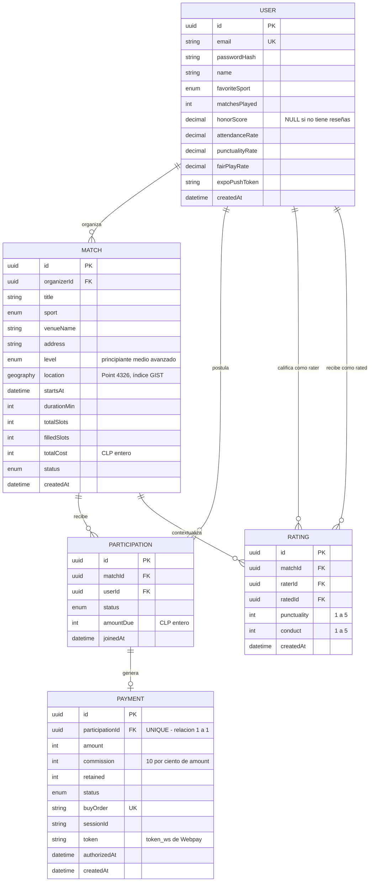

# Modelo de Datos — Kancha

> Entregable del Sprint 3 (01–14 sep 2026) · Issue **KAN-22** · Evidencia de la competencia **C3**
> Fuente de verdad del esquema: `backend/prisma/schema.prisma`. Este documento y el schema van juntos:
> si cambia uno, cambia el otro en el mismo commit.

---

## 1. Decisiones de diseño

| Decisión | Justificación |
|---|---|
| **PostgreSQL 16 + PostGIS**, no NoSQL | El dominio es fuertemente relacional (un partido tiene participaciones, cada una tiene un pago) y requiere integridad transaccional en el cobro. NoSQL obligaría a resolver a mano lo que el motor ya garantiza. |
| **`geography(Point, 4326)`** para la ubicación | Permite resolver la búsqueda por radio en la base de datos con `ST_DWithin` sobre un índice GIST. La alternativa —traer todos los partidos a memoria y calcular haversine en Node— es O(n) por consulta y no escala a más comunas. |
| **Montos en CLP como `Int`**, nunca `Float` | El punto flotante introduce errores de redondeo inaceptables en dinero. El peso chileno no tiene decimales, así que el entero es exacto por naturaleza. |
| **`honorScore` nullable** | Distingue "sin calificaciones aún" de "calificado con 0". Un jugador nuevo no es un mal jugador. |
| **Un solo número de reputación** | El mockup de Fase 1 mostraba un honor de 8.6 y un rating de 4.8 a la vez: dos escalas para lo mismo. Se conserva `honorScore` en 0–10 y se elimina el rating 1–5 para evitar ambigüedad en la interfaz y en los datos. |
| **`matchesPlayed` desnormalizado** | La carta de jugador lo muestra en cada render. Un contador evita un `COUNT` sobre participaciones en cada consulta de perfil. |
| **Restricciones únicas en BD**, no solo en el servicio | `(matchId, userId)` impide postulación duplicada y `(matchId, raterId, ratedId)` impide doble calificación aunque falle la validación de aplicación o haya concurrencia. |
| **`onDelete: Cascade`** en participaciones y reseñas | Eliminar un partido no debe dejar filas huérfanas que rompan el cálculo de honor. |

---

## 2. Diagrama Entidad-Relación



---

## 3. Diccionario de datos

### 3.1 `User` — jugadores de la plataforma

| Campo | Tipo | Nulo | Restricción | Descripción |
|---|---|---|---|---|
| `id` | UUID | No | PK | Identificador |
| `email` | VARCHAR | No | UNIQUE | Credencial de acceso |
| `passwordHash` | VARCHAR | No | — | Hash bcrypt, coste 12. Nunca la contraseña en claro |
| `name` | VARCHAR | No | — | Nombre visible en la carta de jugador |
| `favoriteSport` | ENUM | No | FUTBOL \| PADEL \| BASQUETBOL | Define el feed y las notificaciones |
| `matchesPlayed` | INT | No | default 0, ≥ 0 | Partidos asistidos. Se muestra en la carta de jugador |
| `honorScore` | DECIMAL(3,1) | **Sí** | 0.0–10.0 | NULL = "Sin calificaciones aún". Único número de reputación |
| `attendanceRate` | DECIMAL(5,2) | Sí | 0–100 | Calculado: PAID / (PAID + NO_SHOW) |
| `punctualityRate` | DECIMAL(5,2) | Sí | 0–100 | Promedio de `Rating.punctuality` |
| `fairPlayRate` | DECIMAL(5,2) | Sí | 0–100 | Promedio de `Rating.conduct` |
| `expoPushToken` | VARCHAR | Sí | — | Token de Expo Push para HU-10 |
| `createdAt` | TIMESTAMP | No | default now() | Alta de la cuenta |

### 3.2 `Match` — partidos publicados

| Campo | Tipo | Nulo | Restricción | Descripción |
|---|---|---|---|---|
| `id` | UUID | No | PK | Identificador |
| `organizerId` | UUID | No | FK → User | Quien publica y aprueba postulaciones |
| `title` | VARCHAR | No | — | Nombre visible del partido |
| `sport` | ENUM | No | FUTBOL \| PADEL \| BASQUETBOL | Filtro principal del mapa |
| `venueName` | VARCHAR | No | — | Nombre del recinto |
| `address` | VARCHAR | No | — | Dirección legible |
| `level` | ENUM | No | PRINCIPIANTE \| MEDIO \| AVANZADO, default MEDIO | Nivel esperado. Se muestra en la carta de partido |
| `location` | GEOGRAPHY(Point,4326) | No | **índice GIST** | Coordenada para `ST_DWithin` |
| `startsAt` | TIMESTAMP | No | > now() al crear | Inicio del partido |
| `durationMin` | INT | No | default 60 | Duración; define el cierre y la ventana de reseña |
| `totalSlots` | INT | No | > 0 | Cupos totales |
| `filledSlots` | INT | No | 0 ≤ x ≤ totalSlots | Cupos confirmados |
| `totalCost` | INT | No | ≥ 0, CLP | Arriendo total. 0 = partido gratuito |
| `status` | ENUM | No | OPEN \| FULL \| IN_PROGRESS \| FINISHED \| ARCHIVED \| CANCELLED | Estado del ciclo de vida |
| `createdAt` | TIMESTAMP | No | default now() | Publicación |

### 3.3 `Participation` — postulaciones a un partido

| Campo | Tipo | Nulo | Restricción | Descripción |
|---|---|---|---|---|
| `id` | UUID | No | PK | Identificador |
| `matchId` | UUID | No | FK → Match, ON DELETE CASCADE | Partido |
| `userId` | UUID | No | FK → User | Postulante |
| `status` | ENUM | No | PENDING \| APPROVED \| PAID \| CANCELLED \| NO_SHOW | Estado de la postulación |
| `amountDue` | INT | No | ceil(totalCost/totalSlots) | Monto individual congelado al aprobar |
| `joinedAt` | TIMESTAMP | No | default now() | Momento de la postulación |
| — | — | — | **UNIQUE (matchId, userId)** | Impide postularse dos veces al mismo partido |

### 3.4 `Rating` — calificaciones mutuas post-partido

| Campo | Tipo | Nulo | Restricción | Descripción |
|---|---|---|---|---|
| `id` | UUID | No | PK | Identificador |
| `matchId` | UUID | No | FK → Match, ON DELETE CASCADE | Contexto de la reseña |
| `raterId` | UUID | No | FK → User | Quien califica |
| `ratedId` | UUID | No | FK → User | Quien es calificado |
| `punctuality` | INT | No | 1 ≤ x ≤ 5 | Puntualidad percibida |
| `conduct` | INT | No | 1 ≤ x ≤ 5 | Conducta / juego limpio |
| `createdAt` | TIMESTAMP | No | default now() | Debe caer dentro de las 48 h posteriores |
| — | — | — | **UNIQUE (matchId, raterId, ratedId)** | Impide la doble calificación |

### 3.5 `Payment` — transacciones Webpay

| Campo | Tipo | Nulo | Restricción | Descripción |
|---|---|---|---|---|
| `id` | UUID | No | PK | Identificador |
| `participationId` | UUID | No | FK → Participation, UNIQUE | Relación 1:1 con la participación |
| `amount` | INT | No | CLP | Monto cobrado al jugador |
| `commission` | INT | No | 10% de amount | Ingreso de la plataforma |
| `retained` | INT | No | default 0 | Monto retenido por deserción tardía |
| `status` | ENUM | No | INITIATED \| AUTHORIZED \| FAILED \| REFUNDED \| RETAINED | Estado de la transacción |
| `buyOrder` | VARCHAR | No | UNIQUE | Orden de compra enviada a Transbank |
| `sessionId` | VARCHAR | No | — | Sesión de Webpay |
| `token` | VARCHAR | Sí | — | `token_ws` devuelto por Transbank |
| `authorizedAt` | TIMESTAMP | Sí | — | Momento de la autorización |
| `createdAt` | TIMESTAMP | No | default now() | Inicio de la transacción |

---

## 4. Índices

Son los índices que crean las migraciones de `backend/prisma/migrations/`, con sus nombres reales.

```sql
-- Búsqueda geoespacial (HU-04). Se crea a mano: Prisma no genera índices GIST.
CREATE INDEX idx_match_location ON "Match" USING GIST (location);

-- Filtros del mapa
CREATE INDEX "Match_startsAt_idx"      ON "Match" ("startsAt");
CREATE INDEX "Match_sport_status_idx"  ON "Match" ("sport", "status");
CREATE INDEX "Match_level_idx"         ON "Match" ("level");

-- Consultas de perfil y de honor
CREATE INDEX "User_favoriteSport_idx"          ON "User" ("favoriteSport");
CREATE INDEX "Participation_userId_status_idx" ON "Participation" ("userId", "status");
CREATE INDEX "Rating_ratedId_createdAt_idx"    ON "Rating" ("ratedId", "createdAt");
CREATE INDEX "Payment_status_idx"              ON "Payment" ("status");

-- Unicidad: reglas de negocio garantizadas por la base de datos
CREATE UNIQUE INDEX "User_email_key"                     ON "User" ("email");
CREATE UNIQUE INDEX "Participation_matchId_userId_key"   ON "Participation" ("matchId", "userId");
CREATE UNIQUE INDEX "Rating_matchId_raterId_ratedId_key" ON "Rating" ("matchId", "raterId", "ratedId");
CREATE UNIQUE INDEX "Payment_participationId_key"        ON "Payment" ("participationId");
CREATE UNIQUE INDEX "Payment_buyOrder_key"               ON "Payment" ("buyOrder");
```

El índice GIST es el que sostiene el argumento de escalabilidad de la competencia C3: convierte la
búsqueda geoespacial de un recorrido lineal sobre toda la tabla a una búsqueda sobre un árbol espacial.
`Rating_ratedId_createdAt_idx` sirve al cálculo de honor, que lee las últimas 20 reseñas de un jugador.

---

## 5. Escalabilidad

| Eje | Cómo lo soporta el modelo |
|---|---|
| Más comunas | `location` es geográfica, no un campo "comuna". Sumar territorio no cambia el esquema |
| Más deportes | `sport` es un ENUM: agregar uno es una migración de una línea, sin tocar tablas |
| Más niveles | `level` es un ENUM independiente del deporte: sirve igual para fútbol, pádel y básquet |
| Más historial | `Rating` es append-only; el honor se calcula sobre las últimas 20, no sobre todas |
| Más tráfico | Las consultas críticas están indexadas; `filledSlots` se mantiene desnormalizado para evitar un COUNT por cada pin del mapa |
| Auditoría de pagos | `Payment` conserva `buyOrder`, `token` y timestamps: toda transacción es reconstruible |

---

## 6. Normalización

El modelo está en **tercera forma normal (3FN)**, con cuatro desnormalizaciones deliberadas que se
justifican más abajo.

### 6.1 Verificación por forma normal

| Forma | Qué exige | Cómo la cumple el modelo |
|---|---|---|
| **1FN** | Valores atómicos, sin grupos repetidos, clave primaria en cada tabla | Cada tabla tiene un `id` UUID. No hay columnas multivaluadas: los participantes de un partido no son una lista dentro de `Match`, son filas de `Participation`; las reseñas son filas de `Rating`. `location` es un único valor geográfico, no un par de columnas sueltas |
| **2FN** | Ningún atributo depende de solo una parte de una clave compuesta | Todas las claves primarias son simples, así que no puede haber dependencia parcial. En las claves candidatas compuestas la dependencia también es total: `status` y `amountDue` dependen del par `(matchId, userId)`; `punctuality` y `conduct` dependen del trío `(matchId, raterId, ratedId)` |
| **3FN** | Ningún atributo depende de otro atributo que no sea clave | Los datos del organizador no se copian en `Match`: se llega a ellos por `organizerId`. Los datos del jugador no se copian en `Participation` ni en `Rating`. El detalle de la transacción vive en `Payment`, separado de `Participation`. Los dominios cerrados (`sport`, `level`, estados) son tipos ENUM, no texto libre |

### 6.2 Dependencias funcionales por tabla

| Tabla | Clave primaria | Claves candidatas | Dependencias |
|---|---|---|---|
| `User` | `id` | `email` | `id` → todos los atributos |
| `Match` | `id` | — | `id` → todos los atributos |
| `Participation` | `id` | `(matchId, userId)` | `id` → todos · `(matchId, userId)` → `status`, `amountDue`, `joinedAt` |
| `Rating` | `id` | `(matchId, raterId, ratedId)` | `id` → todos · `(matchId, raterId, ratedId)` → `punctuality`, `conduct`, `createdAt` |
| `Payment` | `id` | `participationId`, `buyOrder` | `id` → todos los atributos |

### 6.3 Desnormalizaciones deliberadas

Son excepciones a la 3FN tomadas a conciencia. Cada una tiene un motivo y una regla que evita que el
dato duplicado quede inconsistente.

| Dato | Por qué rompe la forma normal | Por qué se acepta | Cómo se mantiene consistente |
|---|---|---|---|
| `User.honorScore`, `attendanceRate`, `punctualityRate`, `fairPlayRate` | Se derivan de `Rating` y `Participation` | La carta de jugador se muestra en cada pin y en cada lista: recalcular sobre 20 reseñas por cada render no escala | Solo `honor.service` los escribe, y lo hace en la misma transacción que guarda la reseña |
| `User.matchesPlayed` | Es un conteo de `Participation` | Evita un `COUNT` en cada consulta de perfil | Se incrementa al cerrar una participación como asistida |
| `Match.filledSlots` | Es un conteo de `Participation` aprobadas | Evita un `COUNT` por cada pin del mapa y permite bloquear la fila para no sobrevender cupos | Se actualiza en la misma transacción que aprueba o cancela la participación |
| `Match.venueName`, `address`, `location` | Si un recinto se repite, `venueName` determina `address` y `location`: dependencia transitiva | El MVP no administra recintos: cada organizador escribe el lugar de su partido, que puede ser una cancha pública sin dueño | Cada partido conserva su propia copia. Si el producto pasa a gestionar recintos, se extrae una tabla `Venue` y `Match` queda con `venueId` |

Dos atributos parecen derivados pero no lo son: **`Participation.amountDue`** y **`Payment.commission`**.
Se calculan una vez (cuota = costo / cupos, comisión = 10 %) y se **congelan**. Son hechos históricos:
si mañana cambia el costo del partido o la tasa de comisión, lo ya cobrado no debe cambiar.

### 6.4 Integridad referencial

| Relación | Al borrar el padre | Motivo |
|---|---|---|
| `Match` → `Participation`, `Rating` | `CASCADE` | Un partido eliminado no deja filas huérfanas que alteren el cálculo de honor |
| `Participation` → `Payment` | `CASCADE` | El pago no existe sin su participación |
| `User` → `Match`, `Participation`, `Rating` | `RESTRICT` | No se puede borrar un usuario con historial: se perdería la trazabilidad de pagos y reseñas |

---

## 7. Script de creación

El modelo relacional se materializa con las migraciones versionadas de Prisma. Son SQL estándar de
PostgreSQL y se aplican solas al levantar el proyecto con Docker.

| Archivo | Contenido |
|---|---|
| [`backend/prisma/schema.prisma`](../backend/prisma/schema.prisma) | Definición del modelo, fuente de verdad |
| [`migrations/20260927193802_init/migration.sql`](../backend/prisma/migrations/20260927193802_init/migration.sql) | Extensión PostGIS, tipos ENUM, las cinco tablas, índices y claves foráneas |
| [`migrations/20260927193816_indice_gist_ubicacion/migration.sql`](../backend/prisma/migrations/20260927193816_indice_gist_ubicacion/migration.sql) | Índice espacial GIST sobre `Match.location` |
| [`backend/prisma/seed.ts`](../backend/prisma/seed.ts) | Datos de demo de La Florida |

`User`, `Match`, `Participation` y `Payment` llevan además un campo de auditoría `updatedAt`, que el
ORM actualiza en cada modificación.

---

*Kancha · Portafolio de Título · Lukas Guerrero · Sprint 3, septiembre 2026 · actualizado el 4 de octubre de 2026*
