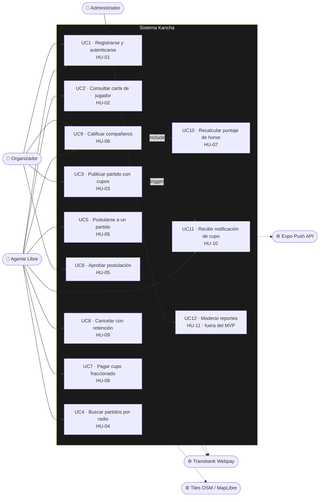
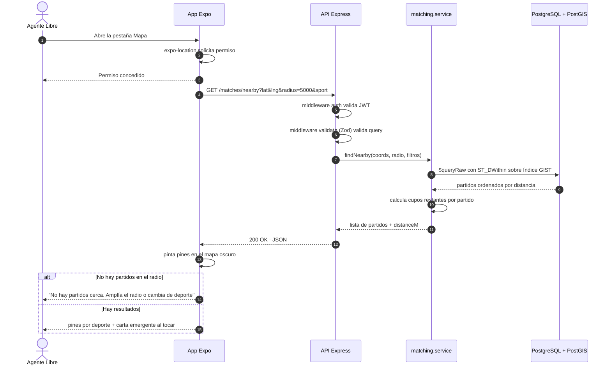
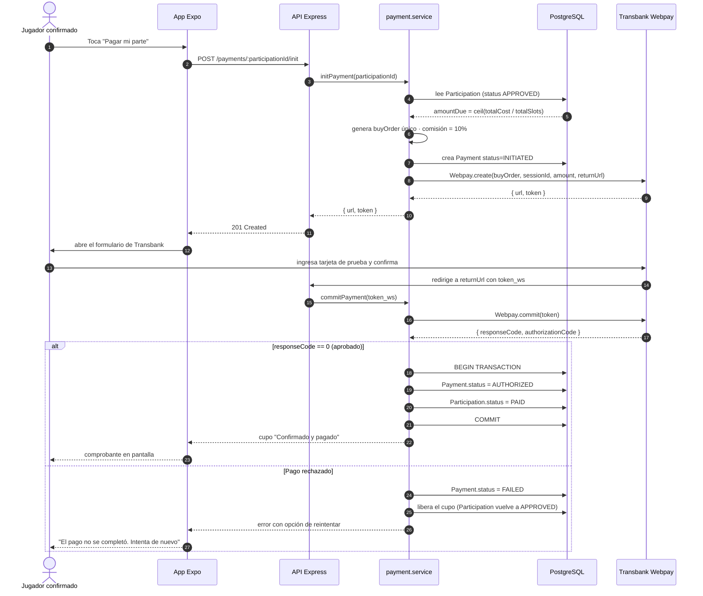
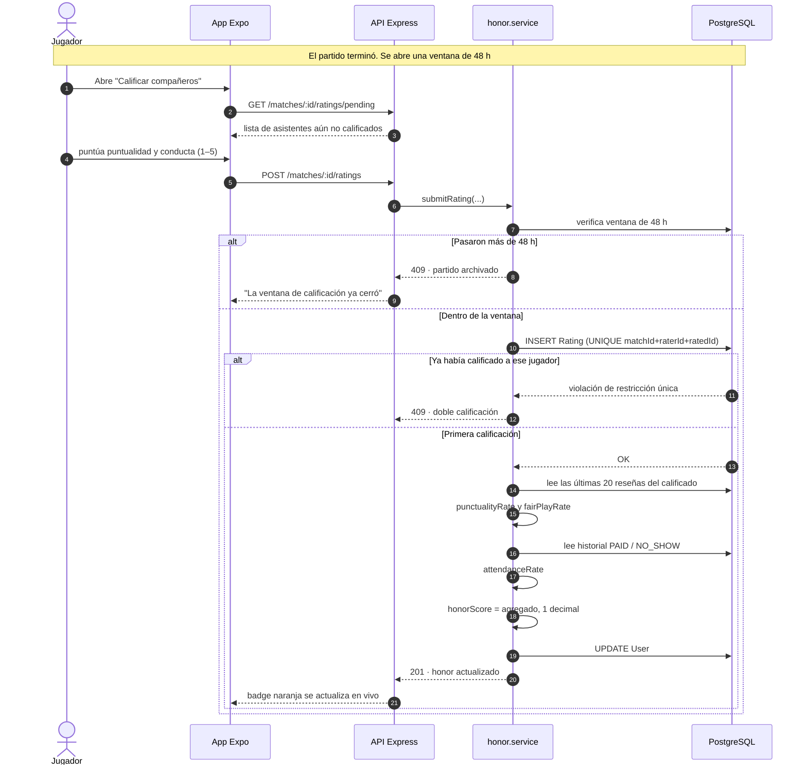
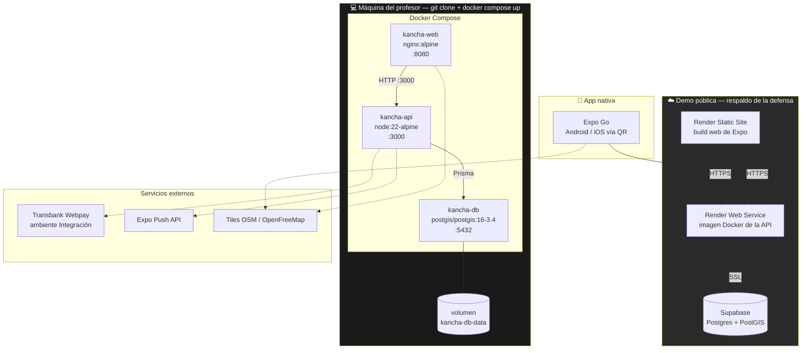
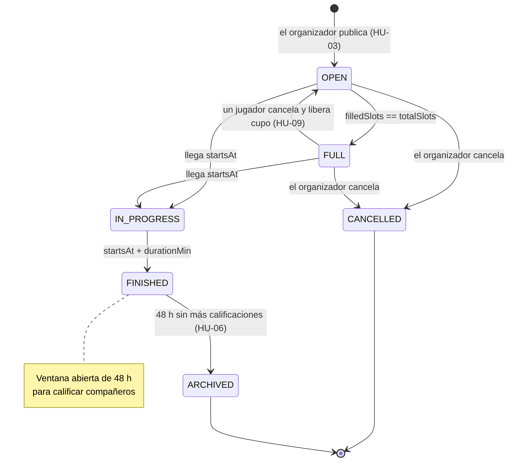

# Diagramas UML — Kancha

> Entregable del Sprint 3 (01–14 sep 2026) · Issue **KAN-22** · Evidencia de las competencias **C3** y **C4**
> Los diagramas están en Mermaid: GitHub los renderiza directamente en el navegador, así que el
> profesor los ve sin descargar nada ni abrir herramientas externas.

---

## 1. Diagrama de Casos de Uso

**Lectura:** los casos de uso con línea continua forman el MVP comprometido (HU-01 a HU-10).
UC12 aparece punteado porque HU-11 está marcada `Won't have this phase` y vive en el backlog.
Las flechas punteadas hacia la derecha marcan la dependencia de sistemas externos.

---

## 2. Secuencia — Búsqueda geolocalizada (HU-04)

Es la consulta central del producto y la evidencia principal de la competencia C3.

---

## 3. Secuencia — Pago fraccionado (HU-08)

Flujo crítico del modelo de negocio. Involucra un sistema externo y debe ser transaccional.

---

## 4. Secuencia — Calificación y recálculo de honor (HU-06 + HU-07)

---

## 5. Diagrama de Despliegue

**Lectura:** el bloque de la izquierda es el plan A de la defensa — todo corre en la máquina del
profesor con un solo comando, sin depender de internet. El bloque de la nube es el respaldo, y la
app nativa se demuestra por QR sobre la misma API desplegada.

---

## 6. Diagrama de estados — Ciclo de vida de un partido

---

*Kancha · Portafolio de Título · Lukas Guerrero · Sprint 3, septiembre 2026*
