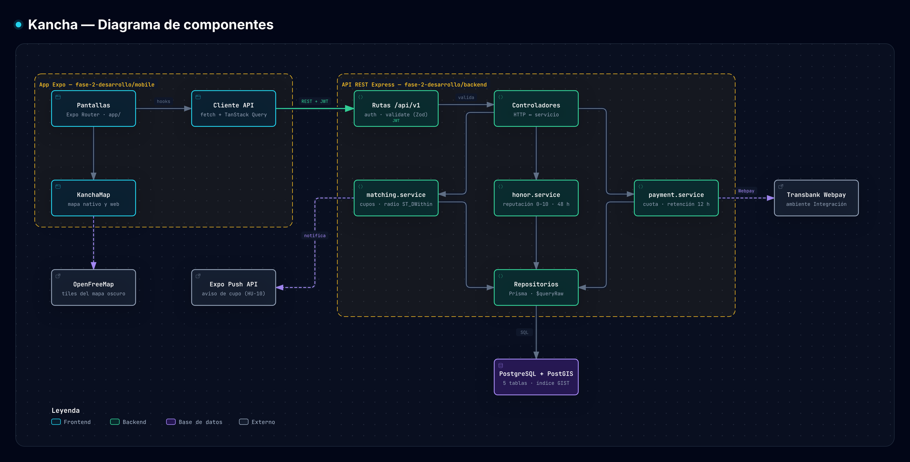
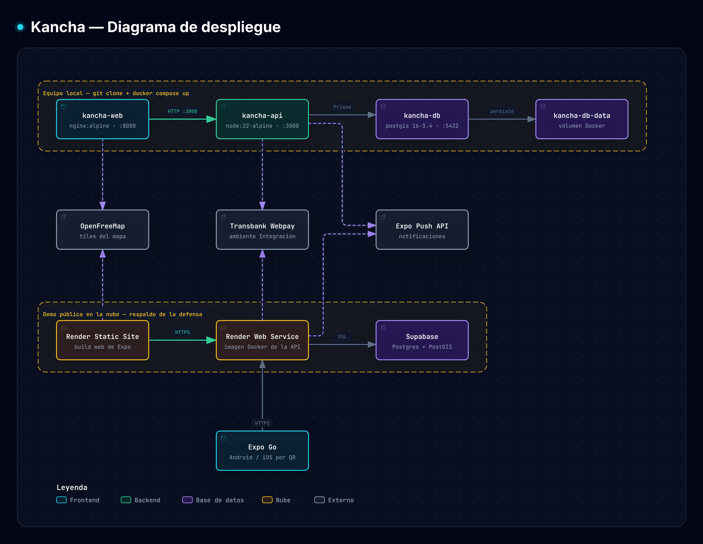

# Arquitectura — Kancha

> Fase 2 · Evidencia de las competencias **C3** y **C4**
> Cubre el ítem de la pauta *Diagrama de Arquitectura (Diagrama de Despliegue – Diagrama de Componentes)*.
> Corte del documento: 4 de octubre de 2026 (Sprint 5).

Kancha es una aplicación cliente-servidor en tres niveles: una app Expo (un solo código para
Android, iOS y web), una API REST en capas sobre Node.js y Express, y una base PostgreSQL con
PostGIS. Todo se levanta con `docker compose up --build`.

Los dos diagramas se generaron con [Archify](https://github.com/tt-a1i/archify). Cada uno tiene una
versión interactiva en HTML: descárgala y ábrela en el navegador para recorrer los nodos, seguir una
ruta o cambiar de tema.

---

## 1. Diagrama de componentes



Versión interactiva: [`diagramas/arquitectura/componentes.html`](diagramas/arquitectura/componentes.html)
· Fuente editable: [`componentes.archify.json`](diagramas/arquitectura/componentes.archify.json)

### 1.1 Responsabilidad de cada componente

| Componente | Responsabilidad | Ubicación | Estado al 4-oct |
|---|---|---|---|
| **Pantallas** | Navegación y vistas con Expo Router | `mobile/app/` | Pantalla puente que consulta `/health`. Las vistas de negocio se construyen desde el Sprint 6 |
| **Cliente API** | Único punto de la app que habla con el backend: agrega el JWT y unifica los errores | `mobile/src/api/client.ts` | Implementado |
| **KanchaMap** | Un mismo componente de mapa con implementación nativa y web | `mobile/src/components/KanchaMap/` | Por implementar (HU-04) |
| **Rutas `/api/v1`** | Declaran los endpoints y encadenan `auth` y `validate` antes del controlador | `backend/src/routes/`, `backend/src/middlewares/` | `/health` y los tres middlewares implementados |
| **Controladores** | Traducen HTTP a llamadas de servicio y de vuelta. Sin lógica de negocio | `backend/src/controllers/` | Por implementar |
| **matching.service** | Búsqueda por radio, aprobación de postulaciones y conteo de cupos sin sobreventa | `backend/src/services/` | Por implementar (HU-04, HU-05) |
| **honor.service** | Cálculo de reputación 0–10 y ventana de 48 h para calificar | `backend/src/services/honor.service.ts` | Implementado · 10 pruebas unitarias |
| **payment.service** | Cuota individual, comisión, retención por deserción y orden de compra Webpay | `backend/src/services/payment.service.ts` | Implementado · 12 pruebas unitarias |
| **Repositorios** | Único acceso a datos: Prisma y `$queryRaw` para las consultas PostGIS | `backend/src/repositories/` | Por implementar · el cliente Prisma ya está configurado |
| **PostgreSQL + PostGIS** | Persistencia relacional y búsqueda geoespacial | `backend/prisma/` | Esquema, dos migraciones y datos de demo listos |

### 1.2 Reglas de dependencia

1. El flujo es siempre `ruta → controlador → servicio → repositorio`. Una ruta nunca toca la base de datos.
2. Las reglas de negocio viven solo en `services/`. Por eso se prueban sin levantar HTTP ni base de datos.
3. Todo error sale por `errorHandler` con la misma forma: `{ error: { code, message, details } }`.
4. La app no conoce la base de datos ni a Transbank: solo conoce la API.
5. Los servicios externos se llaman únicamente desde la capa de servicios.

### 1.3 Servicios externos

| Servicio | Para qué | Quién lo llama |
|---|---|---|
| Transbank Webpay Plus (Integración) | Pago fraccionado del arriendo, sin dinero real | `payment.service` |
| Expo Push API | Aviso de cupo liberado (HU-10) | `matching.service` |
| OpenFreeMap | Tiles del mapa oscuro, sin clave de API | `KanchaMap` |

---

## 2. Diagrama de despliegue



Versión interactiva: [`diagramas/arquitectura/despliegue.html`](diagramas/arquitectura/despliegue.html)
· Fuente editable: [`despliegue.archify.json`](diagramas/arquitectura/despliegue.archify.json)

### 2.1 Nodos del ambiente local

Definidos en [`docker-compose.yml`](../../docker-compose.yml). Es el plan principal de la defensa.

| Contenedor | Imagen | Puerto | Arranque | Chequeo de salud |
|---|---|---|---|---|
| `kancha-db` | `postgis/postgis:16-3.4` | 5432 | Volumen `kancha-db-data` para persistir los datos | `pg_isready` cada 5 s |
| `kancha-api` | `node:22-alpine` (build en dos etapas) | 3000 | Espera a la base sana, aplica migraciones, carga los datos de demo e inicia la API | `GET /api/v1/health` cada 10 s |
| `kancha-web` | `nginx:alpine` con el build web de Expo | 8080 | Espera a la API sana | — |

Al terminar de levantar:

| Dirección | Qué hay |
|---|---|
| `http://localhost:8080` | La app Kancha en su versión web |
| `http://localhost:3000/api/v1/health` | Estado de la API y de la base de datos |

### 2.2 Nodos de la demo en la nube

Es el respaldo de la defensa y se monta en la Fase 3.

| Nodo | Servicio | Contenido |
|---|---|---|
| Sitio estático | Render Static Site | Build web de Expo |
| API | Render Web Service | La misma imagen Docker del backend |
| Base de datos | Supabase | PostgreSQL con la extensión PostGIS |
| App nativa | Expo Go | Se abre por código QR y consume la API de la nube |

---

## 3. Decisiones de arquitectura

| Decisión | Alternativa descartada | Motivo |
|---|---|---|
| Expo con un solo código | Flutter, web pura | Entrega app nativa, versión web proyectable y demo por QR sin publicar en tiendas |
| API en capas con servicios puros | Lógica en los controladores | La lógica de honor y pagos queda testeable de forma aislada |
| PostgreSQL + PostGIS | Base documental, cálculo de distancia en Node | Integridad transaccional en los cobros y búsqueda por radio resuelta con índice espacial |
| Migraciones versionadas de Prisma | `db push` | La base de la demo, la del CI y la de la nube quedan con el mismo esquema |
| Docker Compose como entrega | Instalación manual | El evaluador levanta todo con un comando |
| Transbank en ambiente de Integración | Pasarela simulada propia | Es el estándar chileno y no mueve dinero real |

El detalle del stack y del contrato de la API está en [`DESARROLLO.md`](../../DESARROLLO.md).

---

## 4. Cómo regenerar los diagramas

Los archivos `.archify.json` son la fuente. Con la skill Archify instalada, se le pide al agente:

```
Usa Archify para regenerar fase-2-desarrollo/docs/diagramas/arquitectura/componentes.archify.json
con la interfaz en español y exporta el PNG a fase-2-desarrollo/docs/diagramas/componentes.png
```

Si cambia la arquitectura, se edita el JSON, se regenera el HTML y se reemplaza el PNG en el mismo commit.

---

*Kancha · Portafolio de Título · Lukas Guerrero · Sprint 5, octubre 2026*
