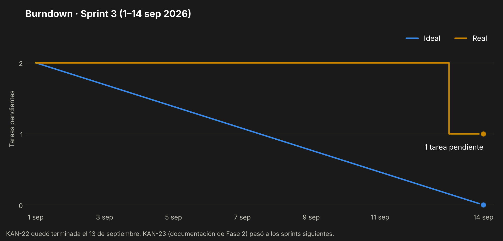

# Sprint 3 — Diseño de la solución

> 1 al 14 de septiembre de 2026 · Primer sprint de la Fase 2
> Registro reconstruido el 4 de octubre de 2026 a partir de Jira, de las fechas de los archivos y de las
> decisiones documentadas. Donde no hay evidencia, se dice.

---

## 1. Sprint Planning

**Objetivo del sprint.** Dejar diseñado el sistema antes de programar: modelo de datos, diagramas
UML y el esqueleto del repositorio.

| Dato | Valor |
|---|---|
| Duración | 14 días (1–14 de septiembre) |
| Equipo | Lukas Guerrero, desarrollador único |
| Origen del objetivo | Roadmap del proyecto (`CLAUDE.md` §5) y carta Gantt de la Fase 1 |
| Estimación | Tareas técnicas sin puntos de historia |

## 2. Sprint Backlog

| Issue | Tipo | Título | Estimación |
|---|---|---|---|
| [KAN-22](https://lukasguerrerokancha.atlassian.net/browse/KAN-22) | Tarea | Modelo de datos y diagramas UML (entregable Sprint 3) | — |
| [KAN-23](https://lukasguerrerokancha.atlassian.net/browse/KAN-23) | Tarea | Hacer documentación Fase 2 | — |

Además se planificó, fuera de Jira, el esqueleto técnico del repositorio (`DESARROLLO.md` §11).

## 3. Scrumboard

Estado del tablero al cierre del sprint (14 de septiembre):

| Por hacer | En curso | Listo |
|---|---|---|
| KAN-23 · Documentación Fase 2 | — | KAN-22 · Modelo de datos y diagramas UML |

KAN-22 se terminó el 13 de septiembre, pero se marcó como *Listo* en Jira recién el 27.

## 4. Burndown Chart

Se mide en tareas porque las issues del sprint no tenían puntos de historia.

## 5. Daily Meeting

Al ser un equipo de una persona, la daily es un registro escrito. **En este sprint no se llevó
registro diario.** La única fecha con evidencia de trabajo es esta:

| Fecha | Trabajo realizado | Evidencia |
|---|---|---|
| 13 sep | Modelo de datos: ER, diccionario e índices | `01-modelo-datos.md` |
| 13 sep | Seis diagramas UML: casos de uso, tres secuencias, despliegue y estados | `02-diagramas-uml.md`, `docs/diagramas/` |
| 13 sep | Guía técnica del proyecto, versión 1.1 | `DESARROLLO.md` |
| 13 sep | Esqueleto del backend, de la app Expo y de Docker Compose | `backend/`, `mobile/`, `docker-compose.yml` |
| 13 sep | Servicios de honor y de pagos con 22 pruebas unitarias | `backend/tests/unit/` |
| 13 sep | Decisiones de alcance: tres deportes con igual peso, honor inicial nulo, HU-11 fuera del MVP | `CLAUDE.md` |

## 6. Registro de impedimentos

| ID | Impedimento | Efecto | Estado |
|---|---|---|---|
| IMP-01 | El sprint no se inició en el tablero Jira | Sin burndown automático ni fecha real de cierre | Abierto |
| IMP-02 | KAN-23 era demasiado amplia ("hacer documentación Fase 2") | No se pudo avanzar por partes ni cerrar | Abordado el 4-oct con los documentos de `docs/` |
| IMP-03 | El ambiente de desarrollo no estaba instalado (Git, Docker, Node) | El esqueleto quedó en la carpeta local, sin publicar | Resuelto el 27-sep (Sprint 4) |

## 7. Release

Durante el sprint el incremento quedó en la carpeta local del proyecto:

- documentos de diseño de la Fase 2 (modelo de datos y diagramas UML);
- esqueleto ejecutable: backend `0.3.0`, app Expo y `docker-compose.yml`.

Se publicó en GitHub el 27 de septiembre, ya en el Sprint 4, con la etiqueta `v0.3.0`
("Sprint 3: modelo de datos, diagramas UML y esqueleto").

## 8. Sprint Review

| Comprometido | Resultado |
|---|---|
| Modelo de datos y diagramas UML (KAN-22) | Entregado |
| Esqueleto del repositorio | Entregado en local, sin publicar |
| Repositorio en GitHub con CI en verde | No entregado, pasó al Sprint 4 |
| Documentación Fase 2 (KAN-23) | No entregado |

## 9. Sprint Retrospective

| Qué funcionó | Qué no funcionó | Acción |
|---|---|---|
| Diseñar antes de programar: el modelo y los diagramas quedaron cerrados | Todo el trabajo se concentró en un solo día | Trabajar en bloques cortos y registrar cada uno |
| Las reglas de negocio quedaron escritas y con pruebas desde el inicio | Jira no reflejó el avance real | Actualizar el tablero el mismo día que se termina una tarea |
| Las decisiones de alcance quedaron documentadas | Una tarea demasiado grande quedó sin moverse | Dividir toda tarea que no se pueda terminar en una sesión |

---

*Kancha · Portafolio de Título · Lukas Guerrero*
