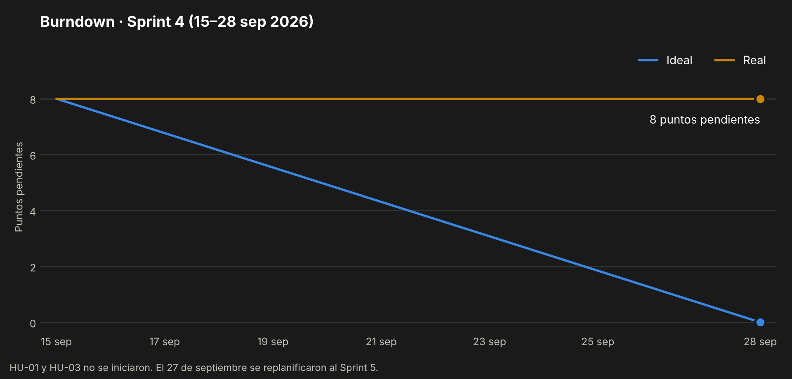

# Sprint 4 — Ambiente de desarrollo y publicación del repositorio

> 15 al 28 de septiembre de 2026 · Fase 2
> Registro reconstruido el 4 de octubre de 2026 a partir de Jira, del historial de commits y de las
> decisiones documentadas. Donde no hay evidencia, se dice.

---

## 1. Sprint Planning

**Objetivo planificado.** Primeras dos historias del backend: registro de agente libre (HU-01) y
publicación de partidos (HU-03).

**Objetivo real.** El sprint se usó en dejar operativo el ambiente de desarrollo y publicar el
repositorio, que eran requisito para programar cualquier historia.

| Dato | Valor |
|---|---|
| Duración | 14 días (15–28 de septiembre) |
| Equipo | Lukas Guerrero, desarrollador único |
| Compromiso | 8 puntos de historia |

## 2. Sprint Backlog

| Issue | Tipo | Título | Prioridad | Puntos |
|---|---|---|---|---|
| [KAN-7](https://lukasguerrerokancha.atlassian.net/browse/KAN-7) | Historia | HU-01 — Registro de agente libre | Must | 3 |
| [KAN-9](https://lukasguerrerokancha.atlassian.net/browse/KAN-9) | Historia | HU-03 — Publicar partido con cupos incompletos | Must | 5 |

Trabajo no planificado que entró al sprint: preparación del ambiente y del repositorio, registrado
después como [KAN-24](https://lukasguerrerokancha.atlassian.net/browse/KAN-24).

## 3. Scrumboard

Estado del tablero al cierre del sprint (28 de septiembre):

| Por hacer | En curso | Listo |
|---|---|---|
| KAN-7 · HU-01 (movida al Sprint 5) | — | KAN-22 · Modelo de datos y UML (cerrada el 27-sep) |
| KAN-9 · HU-03 (movida al Sprint 5) | | |
| KAN-24 · Setup del ambiente (creada el 27-sep) | | |

## 4. Burndown Chart

No se quemó ningún punto: las dos historias no se iniciaron.

## 5. Daily Meeting

**En este sprint no se llevó registro diario.** Las fechas con evidencia son estas:

| Fecha | Trabajo realizado | Evidencia |
|---|---|---|
| 23 sep | Decisión: el repositorio será público para que el profesor entre con el enlace | `DESARROLLO.md` §7.1 |
| 27 sep | Instalación de Git, GitHub CLI, Docker Desktop, Node.js y VS Code | — |
| 27 sep | Reorganización del proyecto en tres carpetas, una por fase | commit `37c0f89` |
| 27 sep | Migraciones iniciales de la base e índice GIST de ubicación | commit `fc01dd9` |
| 27 sep | Corrección de dependencias de la app para el build web | commit `b7ae924` |
| 27 sep | Corrección del arranque de la API dentro de Docker | commit `2b45ad4` |
| 27 sep | README con el estado de cada fase, URL del repositorio y badge del CI | commits `35bb2ad`, `73a4c26` |
| 27 sep | Repositorio publicado en GitHub con ramas `main` y `develop` | [avenaaaa/KANCHA](https://github.com/avenaaaa/KANCHA) |
| 27 sep | Decisiones: la comisión del 10 % se cobra encima de la cuota del jugador, de modo que el recinto recibe el arriendo completo; honor en escala 0–10 | Decisión de producto |
| 27 sep | Replanificación de los sprints 5 a 9 en Jira | Tablero Jira |

## 6. Registro de impedimentos

| ID | Impedimento | Efecto | Estado |
|---|---|---|---|
| IMP-03 | El ambiente de desarrollo no estaba instalado | No se pudo programar hasta el penúltimo día del sprint | Resuelto el 27-sep |
| IMP-04 | La API no arrancaba dentro de Docker | `docker compose up` no dejaba el sistema sano | Resuelto el 27-sep (commit `2b45ad4`) |
| IMP-05 | El build web de la app fallaba por dependencias no declaradas | La versión web no se podía generar | Resuelto el 27-sep (commit `b7ae924`) |
| IMP-06 | Trabajo concentrado en un solo día | Las historias planificadas no se iniciaron | Abierto: se arrastra al Sprint 5 |
| IMP-01 | Los sprints no se inician ni se cierran en el tablero Jira | Sin métricas automáticas | Abierto |

## 7. Release

Primer incremento publicado:

| Dato | Valor |
|---|---|
| Fecha | 27 de septiembre de 2026 |
| Etiqueta | `v0.3.0` — "Sprint 3: modelo de datos, diagramas UML y esqueleto" |
| Commit | `73a4c26` en `main` y `develop` |
| Contenido | Estructura en tres fases, backend con `/health`, servicios de honor y pagos, migraciones, app Expo puente, Docker Compose y CI |
| Verificación | Flujo de CI ejecutado en GitHub Actions para `main` y `develop` |

## 8. Sprint Review

| Comprometido | Resultado |
|---|---|
| HU-01 — Registro de agente libre (3 pts) | No iniciada, pasa al Sprint 5 |
| HU-03 — Publicar partido (5 pts) | No iniciada, pasa al Sprint 5 |

| No planificado | Resultado |
|---|---|
| Ambiente de desarrollo, repositorio público, Docker y CI (KAN-24) | Entregado |

**Velocidad del sprint: 0 de 8 puntos.**

## 9. Sprint Retrospective

| Qué funcionó | Qué no funcionó | Acción |
|---|---|---|
| El repositorio quedó público, ordenado por fases y con CI | Se planificaron historias sin tener el ambiente listo | Verificar los requisitos técnicos antes de comprometer historias |
| Los errores de arranque de la API y del build web se resolvieron el mismo día | El trabajo volvió a concentrarse en un día | Reservar bloques fijos de trabajo en la semana |
| Se replanificó con datos en vez de arrastrar el atraso en silencio | El setup no estaba en el backlog, así que el esfuerzo no se vio | Registrar en Jira todo trabajo técnico, aunque no sea una historia |

**Decisión de replanificación (27 de septiembre).** Las historias se redistribuyeron así en Jira:

| Sprint | Fechas | Historias |
|---|---|---|
| 5 | 29 sep – 12 oct | HU-01, HU-03, KAN-24 |
| 6 | 13 – 26 oct | HU-04, HU-05 |
| 7 | 27 oct – 9 nov | HU-08, HU-09 |
| 8 | 10 – 23 nov | HU-02, HU-06, HU-07 |
| 9 | 24 nov – 7 dic | HU-10 |

---

*Kancha · Portafolio de Título · Lukas Guerrero*
