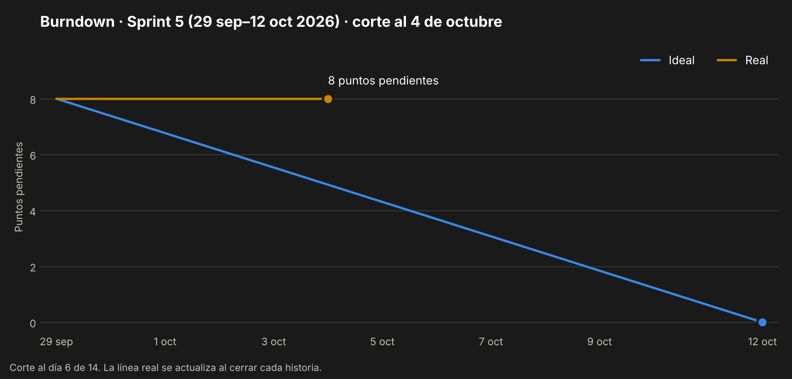

# Sprint 5 — Registro y publicación de partidos

> 29 de septiembre al 12 de octubre de 2026 · Fase 2 · **Sprint en curso**
> Corte de este documento: 4 de octubre de 2026 (día 6 de 14).

---

## 1. Sprint Planning

**Objetivo del sprint.** Primer incremento funcional del backend: un jugador se registra, inicia
sesión y publica un partido.

| Dato | Valor |
|---|---|
| Duración | 14 días (29 de septiembre – 12 de octubre) |
| Equipo | Lukas Guerrero, desarrollador único |
| Compromiso | 8 puntos de historia y una tarea de setup |

## 2. Sprint Backlog

| Issue | Tipo | Título | Prioridad | Puntos | Estado |
|---|---|---|---|---|---|
| [KAN-7](https://lukasguerrerokancha.atlassian.net/browse/KAN-7) | Historia | HU-01 — Registro de agente libre | Must | 3 | Por hacer |
| [KAN-9](https://lukasguerrerokancha.atlassian.net/browse/KAN-9) | Historia | HU-03 — Publicar partido con cupos incompletos | Must | 5 | Por hacer |
| [KAN-24](https://lukasguerrerokancha.atlassian.net/browse/KAN-24) | Tarea | Setup del ambiente: repo GitHub, Docker, CI y reorganización en fases | Must | — | Listo |

Desglose técnico de las historias:

| Historia | Tareas |
|---|---|
| HU-01 | `POST /auth/register` y `POST /auth/login` · hash bcrypt · emisión de JWT · esquemas Zod · pruebas CN-01 a CN-03 e I-02 |
| HU-03 | `POST /matches` con ubicación PostGIS · validación de fecha y cupos · pruebas CN-04 a CN-06 e I-03 |

## 3. Scrumboard

Estado del tablero al 4 de octubre:

| Por hacer | En curso | Listo |
|---|---|---|
| KAN-7 · HU-01 | KAN-23 · Documentación Fase 2 | KAN-24 · Setup del ambiente |
| KAN-9 · HU-03 | | |

## 4. Burndown Chart

Al día 6 no se ha quemado ningún punto. La línea ideal marca 5 puntos pendientes a esta fecha.

## 5. Daily Meeting

Desde este sprint el registro se lleva día a día, con las tres preguntas de la daily.

| Fecha | Qué hice | Qué haré | Impedimentos |
|---|---|---|---|
| 3 oct | Sincronicé el repositorio. Apareció la rama `DiegoGarcesM-patch-1` (Pull Request #1, de un tercero) | — | — |
| 4 oct | Documentación de la Fase 2: arquitectura, diagramas de clases, normalización, plan de pruebas y documentos de sprint. Ejecución de las 22 pruebas unitarias. División de las épicas de 6 a 10 tras la observación de la Fase 1 (Word, Excel y Jira). Orden del repositorio en `entrega/` y `docs/` por fase | Commit y push de la documentación. Iniciar HU-01 | La documentación desplazó el inicio de HU-01 |

Entre el 29 de septiembre y el 2 de octubre no hay registro de actividad.

## 6. Registro de impedimentos

| ID | Impedimento | Efecto | Estado |
|---|---|---|---|
| IMP-06 | Trabajo concentrado en pocos días | Seis días de sprint sin avance en las historias | Abierto |
| IMP-01 | El Sprint 5 no está iniciado en Jira y el Sprint 2 sigue como activo | Sin métricas automáticas | Abierto |
| IMP-07 | La documentación de la Fase 2 (KAN-23) estaba pendiente desde el Sprint 3 | Ocupó tiempo del sprint | En resolución el 4-oct |
| IMP-08 | Con cobertura activada, el umbral global de pruebas falla (DEF-01 del plan de pruebas) | Bloquearía el CI si se activa la cobertura | Abierto |

## 7. Release

Pendiente. Al cierre del sprint se publica el incremento con HU-01 y HU-03.

## 8. Sprint Review

Se completa al cierre del sprint, el 12 de octubre.

## 9. Sprint Retrospective

Se completa al cierre del sprint, el 12 de octubre.

---

*Kancha · Portafolio de Título · Lukas Guerrero*
